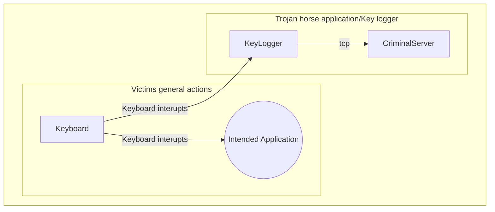
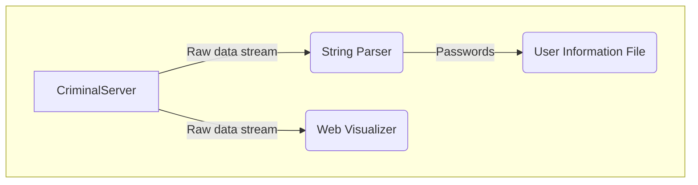
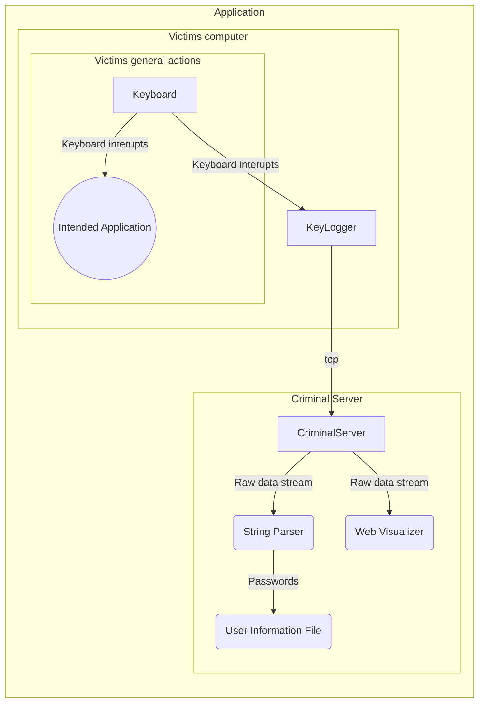

## [Weather App Repo](https://github.com/EECE3093C/team_orange_WeatherApp)
## [Web Server Repo](https://github.com/EECE3093C/team-orange-WebServer)

# Trojan Horse Weather Application
The Trojan Horse Weather Application is a research application for malware attacks that commonly plague the internet today. The goal of the application is to raise awareness for trojan horse attacks and to prevent potential victims from getting their information stolen.
## Vision
### The application
The Trojan Horse application is a common weather application that will be used to demonstrate to the user what information can be taken from them unknowingly. There will be two components: a key logger and a client to recieve the message stream.
### Whom is the demonstration trojan horse application for?
The trojan horse application is for users all across the internet. It can show anyone who uses a Linux system what a cyber-criminal is capable of doing with your information. Even though there is a possibly wide demographic for the application, the intended demographic is college students.
### What problem does it solve
The problem addressed by the Demonstration Trojan Horse is to help prevent cyber attacks from criminals looking to steal your information. The main goal of the trojan horse is to show the user some of the capabilities dangerous applications can have. This, in turn, will raise skepticism in students as they are approaching other unknown applications.
### Alternatives
There are many alternative options to key loggers, however, these are only a part of our solution and will not compete with the whole project. HackerOne is an application that helps assess the vulnerability of your applications, but is meant for larger companies, not individuals.

https://www.hackerone.com/

https://github.com/GiacomoLaw/Keylogger

https://github.com/ajayrandhawa/Keylogger

## How is it different?
The demonstration Trojan Horse is different because it will target a specific victim profile. The Trojan Horse will target students and will be shielded behind a weather widget.
## Software Architecture
### Key Logger
The Trojan Horse application will feature two seperate components. Firstly, the key-logger. The intention of the key logger is to make the "victims" key strokes known by the "cyber criminal". In this application, the key strokes will be logged and sent to the server where the "cyber criminal" can look for patterns or specific strings. For example "sudo" would point to the fact that the "victim" may shortly be entering their password.
The Key Logger will be housed in a benign application that seems to be very inconspicuous, such as a weather application. This will give the "Victim" something to look at that they have downloaded. This simulates a trojan horse that might actually have malicious intent 

### Criminal Server
The second component of the demonstration trojan horse is to interpret the information that is being sent by the "victim" without them knowing. This part of the application will recieve the data from the "victims" computer and will look for specific strings that are very common in linux machines. For example, the Trojan Horse will identify the "victims" password from a command that uses sudo. The application will store the data in a file to show the "Victim" later.
Additionally, the Criminal server will have a web interface that the "victim" can use to see what the potential criminals could be gaining from their computer usage.

## Application full diagram

## Tools/Intended platform
### Operating System
For this demonstration Trojan Horse, Linux operating systems will be targeted. This is because of the wide-spread use of linux on many different servers and for ease of development. Also, it is easy to instantiate a VM that has linux operating systems installed
### Languages/tools used
The primary programming language is c++ and the web server will be developed in javascript.
## Challenges and Risks
The biggest risk and challenge that this project faces is to be responsible with our application. We plan to mitigate this by not storing any data after the application has been shut down and to make the user well aware that the application is a Trojan Horse. This will be done by having the application say "TROJAN HORSE" at the top. Additionally, all information that is gathered by the trojan horse will be visible to the "victim" for their exposure.
