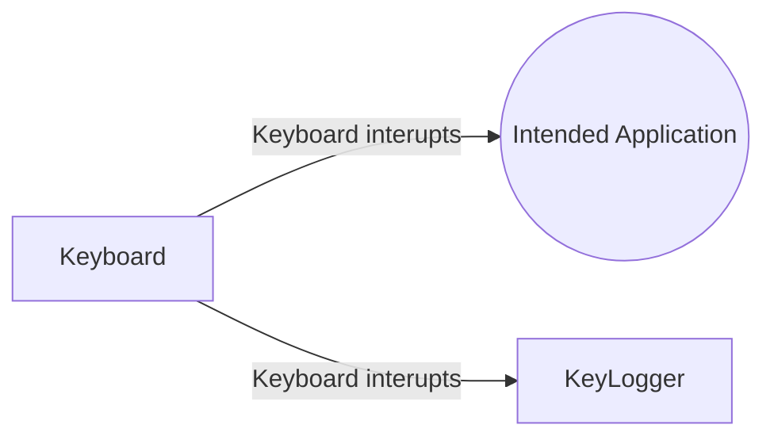

# Trojan Horse Weather Application
The Trojan Horse Weather Application is a research application for phishing schemes that commonly plauge the internet today. The goal of the application is to raise awareness for phising schemes and to prevent potential victims from getting their information stolen
## Vision
### The application
The Trojan Horse application is a common weather application that will be used to demonstrate to the user what information can be taken from them unknowingly. There will be two components: a key logger and a client to recieve the message stream.
### Whom is the demonstration trojan horse application for?
The trojan horse application is for users all across the internet. It can show anyone who uses a Linux system what a cyber-criminal is capable of doing with your information. Even though there is a possibly wide demographic for the application, the intended demographic is college students.
### What problem does it solve
The problem addressed by the Demonstration Trojan Horse is to help prevent cyber attacks from criminals looking to steal your information. The main goal of the trojan horse is to show the user some of the capabilities dangerous applications can have. This, in turn, will raise skepticism in students as they are approaching other unknown applications.
### Alternatives
There are many alternative options to key loggers, however, these are only a part of our solution and will not compete with the whole project. HackerOne is an application that helps assess the vulnerability of your applications, but is meant for larger companies, not individuals.

https://www.hackerone.com/

https://github.com/GiacomoLaw/Keylogger

https://github.com/ajayrandhawa/Keylogger

## How is it different?
The demonstration Trojan Horse is different because it will target a specific victim profile. The Trojan Horse will target students and will be shielded behind a weather widget.
## Software Architecture
The Trojan Horse application will feature two seperate components. Firstly, the key-logger. The intention of the key logger is to make the "victims" key strokes known by the "cyber criminal". In this application, the key strokes will be logged and sent to the server where the "cyber criminal" can look for patterns or specific strings. For example "sudo" would point to the fact that the "victim" may shortly be entering their password.

